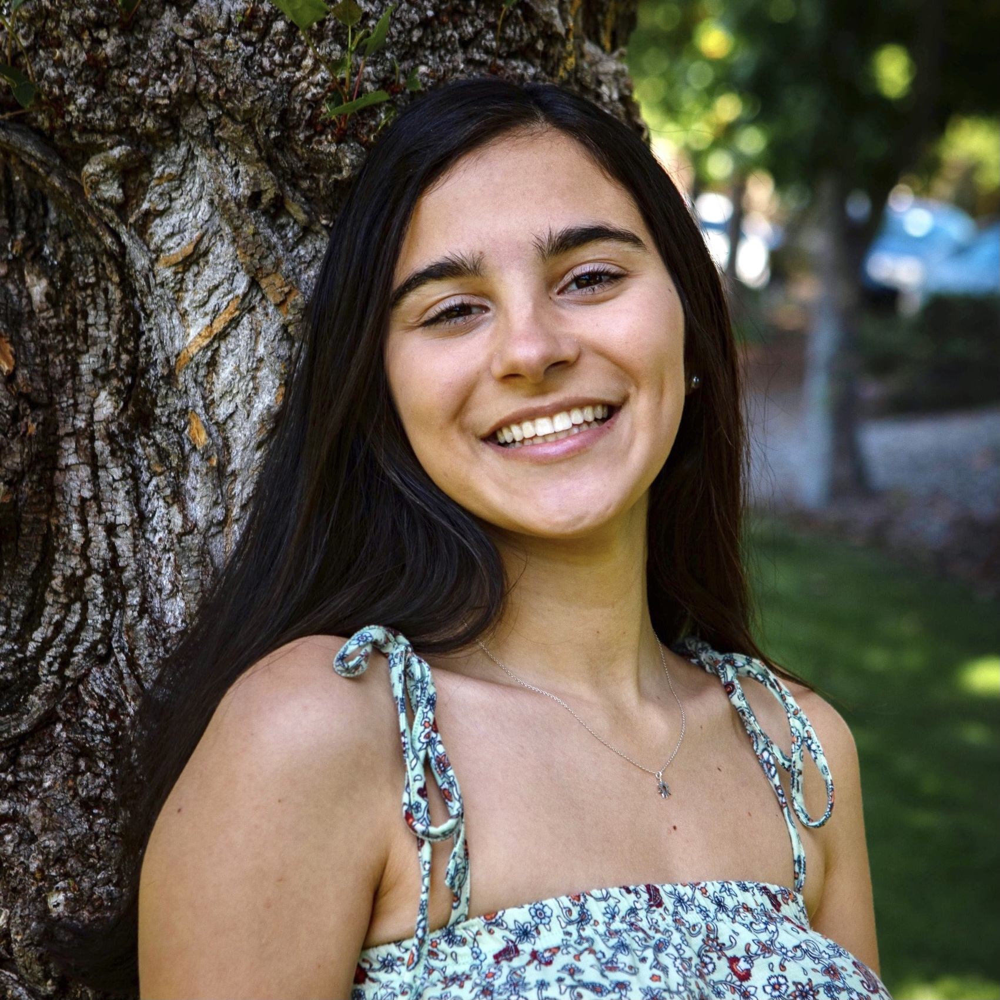

# Sydney Segal
## I'm a passionate, creative, and detail-oriented third-year undergrad with a history of academic and professional accomplishments.

## Skills
1. Spanish proficiency
2. Adobe Creative Suite
3. WordPress content management system

|Employer|Job Description|
|--------|---------------|
|Marin Living Magazine|
* Author editorial content for monthly publication to 90,000 readers|
* Research and copy-edit to ensure factual and grammatical accuracy|
* Convert print content to SEO-friendly digital content using WordPress|
|Camp EDMO|
* Mentor K-8 children one-on-one in various subjects and personal growth|
* Develop curriculum for academic topics including English (writing/reading) and Spanish, as well as hobbies such as painting and crafting|
|--------|---------------|
|Archway App|
* Created Instagram and web content to promote membership and events|
* Increased online engagement with user behavior analysis and media planning|
* Initiated sales outreach to Berkeley students and local business partners|
